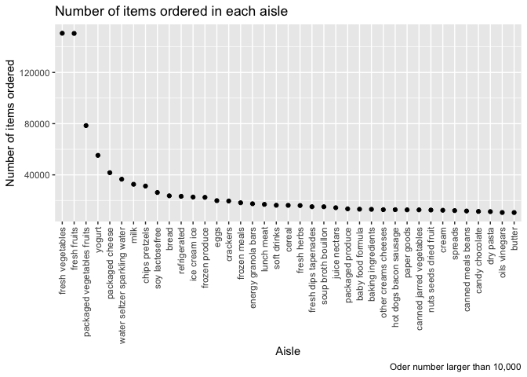
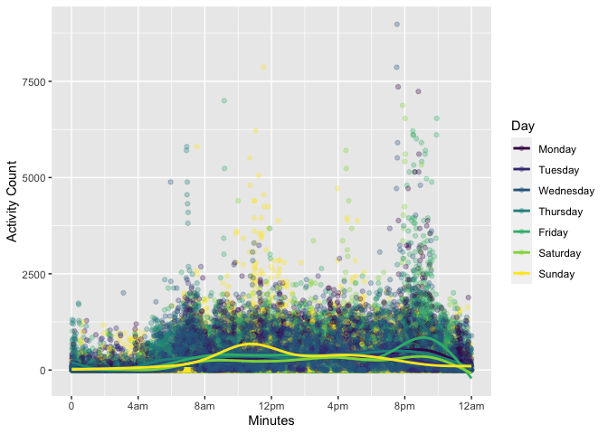
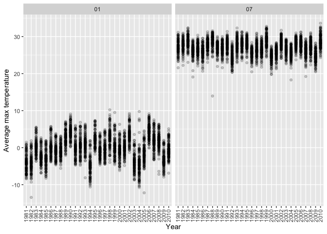
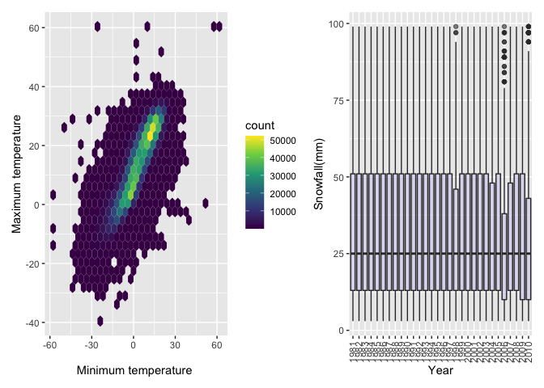

p8105_hw3_yx2710
================

``` r
library(tidyverse)
```

    ## ── Attaching packages ─────────────────────────────────────── tidyverse 1.3.2 ──
    ## ✔ ggplot2 3.3.6      ✔ purrr   0.3.4 
    ## ✔ tibble  3.1.8      ✔ dplyr   1.0.10
    ## ✔ tidyr   1.2.1      ✔ stringr 1.4.1 
    ## ✔ readr   2.1.2      ✔ forcats 0.5.2 
    ## ── Conflicts ────────────────────────────────────────── tidyverse_conflicts() ──
    ## ✖ dplyr::filter() masks stats::filter()
    ## ✖ dplyr::lag()    masks stats::lag()

``` r
library(p8105.datasets)
library(patchwork)
library(hexbin)
```

Problem 1

``` r
data("instacart")
```

Short description of the instacart dataset: The instacart dataset has
1384617 rows and 15 columns. The variables that the instacart dataset
contain are order_id, product_id, add_to_cart_order, reordered, user_id,
eval_set, order_number, order_dow, order_hour_of_day,
days_since_prior_order, product_name, aisle_id, department_id, aisle,
department

-   “reordered”: 1 means this product has been ordered by this user
    before, 0 otherwise.

-   “eval_set”: which evaluation set this order is included (Note that
    eval_set of this dataset is exclusively from the “train”)

-   “order_dow”: the day of the week on which the order was placed

-   “aisle”: the name of the aisle

-   “department”: the name of the department

Q:How many aisles are there, and which aisles are the most items ordered
from?

``` r
instacart %>% 
  count(aisle, name = "n") %>% 
  arrange(-n)
```

    ## # A tibble: 134 × 2
    ##    aisle                              n
    ##    <chr>                          <int>
    ##  1 fresh vegetables              150609
    ##  2 fresh fruits                  150473
    ##  3 packaged vegetables fruits     78493
    ##  4 yogurt                         55240
    ##  5 packaged cheese                41699
    ##  6 water seltzer sparkling water  36617
    ##  7 milk                           32644
    ##  8 chips pretzels                 31269
    ##  9 soy lactosefree                26240
    ## 10 bread                          23635
    ## # … with 124 more rows

A: There are 134 aisles and fresh vegetables are the most items ordered
from.

Q: Make a plot that shows the number of items ordered in each aisle,
limiting this to aisles with more than 10000 items ordered. Arrange
aisles sensibly, and organize your plot so others can read it.

``` r
instacart %>% 
  count(aisle, name = "n") %>%
  filter(n > 10000) %>% 
  mutate(aisle = fct_reorder(aisle, n, .desc = TRUE)) %>% 
  ggplot(aes(x = aisle, y = n)) + geom_point() +
  labs(
    title = "Number of items ordered in each aisle",
    x = "Aisle",
    y = "Number of items ordered",
    caption = "Oder number larger than 10,000"
  )+
  theme(axis.text.x = element_text(angle = 90, vjust = 0.5, hjust = 1))
```

<!-- --> A:
The plot is shown here and this plot also shows the answer that fresh
vegetables are the most items ordered from.

Q:Make a table showing the three most popular items in each of the
aisles “baking ingredients”, “dog food care”, and “packaged vegetables
fruits”. Include the number of times each item is ordered in your table.

``` r
instacart %>% 
  filter(aisle == c("baking ingredients", "dog food care", "packaged vegetables fruits")) %>% 
  group_by(aisle, product_name) %>% 
  summarise(count = n()) %>% 
  top_n(3, count) %>% 
  knitr::kable()
```

    ## `summarise()` has grouped output by 'aisle'. You can override using the
    ## `.groups` argument.

| aisle                      | product_name                                    | count |
|:---------------------------|:------------------------------------------------|------:|
| baking ingredients         | Light Brown Sugar                               |   157 |
| baking ingredients         | Organic Vanilla Extract                         |   122 |
| baking ingredients         | Pure Baking Soda                                |   140 |
| dog food care              | Organix Chicken & Brown Rice Recipe             |    13 |
| dog food care              | Organix Grain Free Chicken & Vegetable Dog Food |    14 |
| dog food care              | Original Dry Dog                                |     9 |
| packaged vegetables fruits | Organic Baby Spinach                            |  3324 |
| packaged vegetables fruits | Organic Blueberries                             |  1692 |
| packaged vegetables fruits | Organic Raspberries                             |  1920 |

A: The table is shown here.

Q: Make a table showing the mean hour of the day at which Pink Lady
Apples and Coffee Ice Cream are ordered on each day of the week; format
this table for human readers (i.e. produce a 2 x 7 table).

``` r
instacart %>% 
  filter(product_name == c("Pink Lady Apples", "Coffee Ice Cream")) %>% 
  group_by(product_name, order_dow) %>% 
  summarise(mean_hour = mean(order_hour_of_day)) %>% 
  pivot_wider(
    names_from = product_name,
    values_from = mean_hour
  ) %>% 
  knitr::kable()
```

    ## Warning in product_name == c("Pink Lady Apples", "Coffee Ice Cream"): 长的对象长
    ## 度不是短的对象长度的整倍数

    ## `summarise()` has grouped output by 'product_name'. You can override using the
    ## `.groups` argument.

| order_dow | Coffee Ice Cream | Pink Lady Apples |
|----------:|-----------------:|-----------------:|
|         0 |         13.22222 |         12.25000 |
|         1 |         15.00000 |         11.67857 |
|         2 |         15.33333 |         12.00000 |
|         3 |         15.40000 |         13.93750 |
|         4 |         15.16667 |         11.90909 |
|         5 |         10.33333 |         13.86957 |
|         6 |         12.35294 |         11.55556 |

A: The table is shown here.

Problem 2

``` r
accel_df = read_csv("./data/accel_data.csv") %>% 
  janitor::clean_names() %>% 
  mutate(week_d = ifelse(day %in% c("Saturday", "Sunday"), "Weekend", "Weekday")) %>% 
  pivot_longer(
    activity_1:activity_1440,
    names_to = "minute",
    names_prefix = "activity_",
    values_to = "activity_count"
  ) %>% 
  select(week, day_id, day, week_d, everything()) %>% 
  mutate(
    day = factor(day),
    minute = as.numeric(minute)
  )
```

    ## Rows: 35 Columns: 1443
    ## ── Column specification ────────────────────────────────────────────────────────
    ## Delimiter: ","
    ## chr    (1): day
    ## dbl (1442): week, day_id, activity.1, activity.2, activity.3, activity.4, ac...
    ## 
    ## ℹ Use `spec()` to retrieve the full column specification for this data.
    ## ℹ Specify the column types or set `show_col_types = FALSE` to quiet this message.

The 6 variables that dataset contains are week, day_id, day, week_d,
minute, activity_count and there are 50400 observations.

Create a total activity variable for each day, and create a table
showing these totals.

``` r
accel_df %>% 
  mutate(day = forcats::fct_relevel(day, c("Monday", "Tuesday", "Wednesday", "Thursday", "Friday", "Saturday", "Sunday"))) %>% 
  group_by(day) %>% 
  summarize(total_activity = sum(activity_count)) %>% 
  knitr::kable()
```

| day       | total_activity |
|:----------|---------------:|
| Monday    |        1858699 |
| Tuesday   |        1799238 |
| Wednesday |        2129772 |
| Thursday  |        2091151 |
| Friday    |        2291711 |
| Saturday  |        1369237 |
| Sunday    |        1919213 |

There is no apparent trend.

24-hour activity time courses for each day

``` r
accel_df %>% 
  mutate(day = forcats::fct_relevel(day, c("Monday", "Tuesday", "Wednesday", "Thursday", "Friday", "Saturday", "Sunday"))) %>% 
  ggplot(aes(x = minute, y = activity_count, color = day)) +
  geom_point(alpha = 0.3) +
  labs(
    x = "Minutes",
    y = "Activity Count"
  )+
  scale_x_continuous(
    breaks = c(0, 240, 480, 720, 960, 1200, 1440),
    labels = c("0", "4am", "8am", "12pm", "4pm", "8pm", "12am")
  )+ geom_smooth(se = FALSE)+
    viridis::scale_color_viridis(
    name = "Day", 
    discrete = TRUE
  )
```

    ## `geom_smooth()` using method = 'gam' and formula 'y ~ s(x, bs = "cs")'

<!-- --> The
plot tells us that most activities happened between 8am-12pm and
8pm-12am.Also, most activity counts are less than 2500.

Problem 3

``` r
library(p8105.datasets)
data("ny_noaa")
```

The dataset has 7 columns and 2595176 rows. The variables this dataset
contains are id, date, prcp, snow, snwd, tmax, tmin. Key variables in
ny_noaa: \* prcp: Precipitation (tenths of mm) \* snow: Snowfall (mm) \*
snwd: Snow depth (mm) \* tmax: Maximum temperature (tenths of degrees C)
\* tmin: Minimum temperature (tenths of degrees C)

The proportion of NA in this dataset is 0.2610708\` and I think it is
somewhat severe.

``` r
ny_noaa_c = ny_noaa %>% 
  separate(date, into = c("year", "month", "day"), sep="-", remove = TRUE) %>% 
   mutate(
    prcp = prcp/10,
    tmax = as.numeric(tmax)/10,
    tmin = as.numeric(tmin)/10
    ) 

ny_noaa_c%>% 
  group_by(snow) %>% 
  summarise(snow_n = n()) %>% 
  arrange(-snow_n)
```

    ## # A tibble: 282 × 2
    ##     snow  snow_n
    ##    <int>   <int>
    ##  1     0 2008508
    ##  2    NA  381221
    ##  3    25   31022
    ##  4    13   23095
    ##  5    51   18274
    ##  6    76   10173
    ##  7     8    9962
    ##  8     5    9748
    ##  9    38    9197
    ## 10     3    8790
    ## # … with 272 more rows

From snow, the most commonly observed value is 0, which means most days
in NY do not snow.

Make a two-panel plot

``` r
Two_panel_plot = ny_noaa_c %>% 
  filter(month %in% c("01","07")) %>% 
  group_by(id, year, month) %>% 
  summarize(mean_tmax = mean(tmax, na.rm = TRUE)) %>% 
  drop_na() %>% 
  ggplot(aes(x = year, y = mean_tmax))+
  geom_point(alpha = .2)+
  geom_smooth()+
  facet_grid(. ~ month)+
  theme(axis.text.x = element_text(angle = 90, vjust = 0.5, hjust = 1))+
  xlab("Year") +
  ylab("Average max temperature")
```

    ## `summarise()` has grouped output by 'id', 'year'. You can override using the
    ## `.groups` argument.

``` r
Two_panel_plot
```

    ## `geom_smooth()` using method = 'loess' and formula 'y ~ x'

<!-- -->

From the plot, we can figure out that most of average max temperatures
of January locate between -10 degrees C to 10 degrees C, and most of
average max temperatures of July concentrate between 20 degrees C and 40
degrees C. There are some outliers, such as in 1982 and 2005, the
mean_tmax is lower than -10 degree C in Jan and in July of 1988, the
mean_tmax is lower than 20 degrees C.

Make a two-panel plot showing

1)  tmax vs tmin for the full dataset

2)  make a plot showing the distribution of snowfall values greater than
    0 and less than 100 separately by year.

``` r
t_t_plot = ny_noaa_c %>% 
  ggplot(aes(x = tmin, y = tmax)) + 
  geom_hex() +
  scale_fill_viridis_c() +
  xlab("Minimum temperature ") +
  ylab("Maximum temperature")

snow_plot = ny_noaa_c %>% 
  filter(snow > 0 & snow < 100) %>% 
  ggplot(aes(x = year, y = snow)) +
  geom_boxplot(fill="slateblue", alpha=0.2) +
  theme(axis.text.x = element_text(angle = 90, vjust = 0.5, hjust = 1))+
  xlab("Year") +
  ylab("Snowfall(mm)")

t_t_plot + snow_plot 
```

    ## Warning: Removed 1136276 rows containing non-finite values (stat_binhex).

<!-- -->
